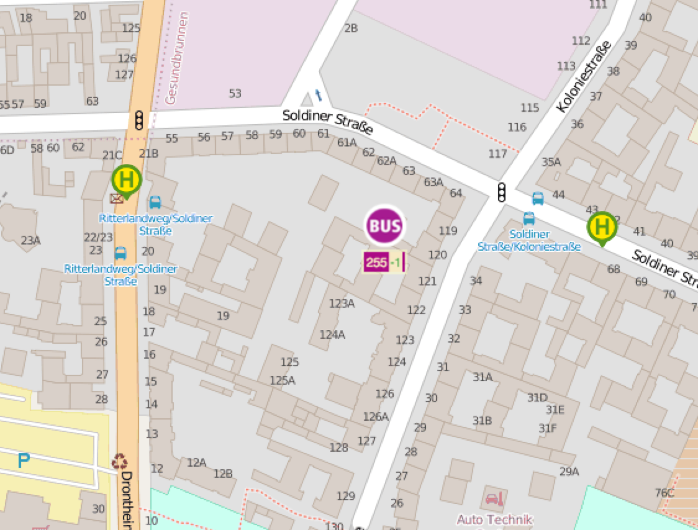

# vbb-positions-stream

**Get realtime positions of VBB vehicles** in a certain area. However the data is really crappy:



[](https://www.npmjs.com/package/vbb-positions-stream)
[](https://travis-ci.org/derhuerst/vbb-positions-stream)

[](https://gitter.im/derhuerst/vbb-rest)


## Installing

```shell
npm install vbb-positions-stream
```


## Usage

```js
const positions = require('vbb-positions-stream')
positions([52.4983, 13.3917, 52.4984, 13.3918])
.on('data', console.log)
```

```js
{line:'120', product: 'bus', latitude: 13.360289, longitude: 52.545958, when: 1464789063970}
{line: '120', product: 'bus', latitude: 13.360271, longitude: 52.545967, when: 1464789064970}
{line: '50', product: 'bus', latitude: 13.356289, longitude: 52.552673, when: 1464789034970}
{line: '50', product: 'bus', latitude: 13.356226, longitude: 52.552646, when: 1464789035970}
{line: '50', product: 'bus', latitude: 13.356172, longitude: 52.552619, when: 1464789036970}
```


## Contributing

If you **have a question**, **found a bug** or want to **propose a feature**, have a look at [the issues page](https://github.com/derhuerst/vbb-positions-stream/issues).
